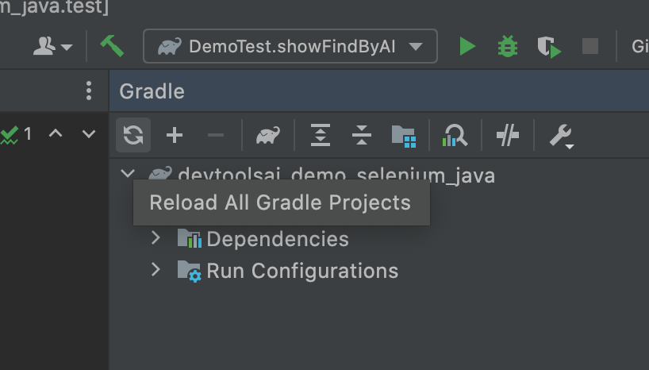
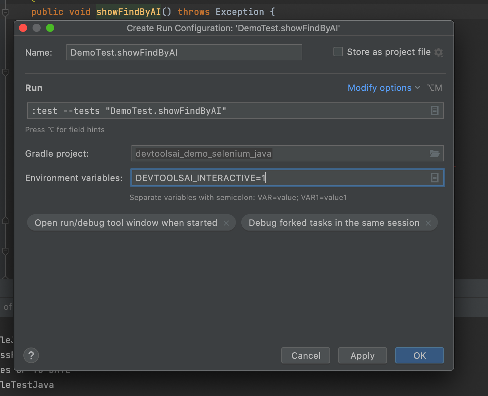

# devtoolsai_demo_selenium_python
Sample project showing how to use SmartDriver with Selenium python.
The project is meant to be open with the IDE IntelliJ from JetBrains. If you use Eclipse or others you will have to adjust the instructions, particularly the env variable part.

# Setup
Open the project with IntelliJ

Trigger a gradle sync to install all the dependencies

# Run the tests

There are two tests:
 - DemoTest:showFindByAI that shows how to build a test case without locator by prompting the user for bounding boxes
 - DemoTEst:showIngest that shows how an existing test case using xpaths or other locators can be ingested to become visual elements.

## Find by AI test

To fully experience this one, you need to enable an environment variable (DEVTOOLSAI_INTERACTIVE=1)
To do that, right click on the showFindByAI function name and click 'Modify run configuration', then input `DEVTOOLSAI_INTERACTIVE=1`

After that you can right click and click on 'Run showFindByAI', the test will run and you will be prompted to draw the search box.

## Ingest test
You can right click and click on 'Run showIngest', the test will run and the elements will be ingested in the dashboard
